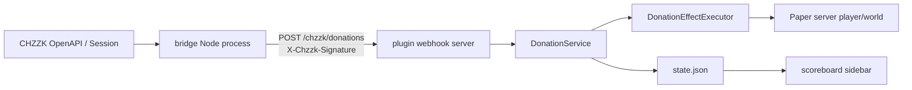

# Architecture Overview

이 저장소는 CHZZK 후원 이벤트를 Minecraft Paper 서버의 게임 효과로 변환한다. 런타임은 두 프로세스로 나뉜다.

- `bridge/`: Node.js TypeScript 프로세스. CHZZK OpenAPI 인증을 갱신하고 Session Socket.IO 이벤트를 수신한다.
- `plugin/`: Java 21 Paper 플러그인. 로컬 HTTP webhook을 열고, HMAC 검증 후 Minecraft 메인 스레드에서 효과를 실행한다.

## 시스템 경계

## 루트 영역

대표 파일:

- `README.md`: 현재 사용자가 실행할 기본 Docker/검증 명령.
- `PLAN.md`: 구현 의도, 후원 티어, 인터페이스, 테스트 계획의 원본 계획.
- `package.json`: 루트 npm 스크립트. 현재 bridge 테스트/빌드와 Docker 명령을 위임한다.
- `build.gradle.kts`, `settings.gradle.kts`: 루트 Gradle 태스크와 `plugin` 모듈 연결.
- `.env.example`: Docker compose 기준 환경 변수 예시.
- `AGENTS.md`: 작업 규칙과 문서 참조 경로.

루트 파일을 바꿀 때는 전체 실행 방식이나 작업 규칙이 바뀌는지 먼저 확인한다. 단일 서비스만 바꾸는 경우 루트 스크립트까지 넓히지 않는다.

## 플러그인 영역

`plugin/`은 Paper 서버 안에서 실행된다. 핵심 책임은 다음과 같다.

- `ChzzkDonationPlugin.java`: 플러그인 라이프사이클, 서비스 조립, webhook 시작/정지, reload.
- `command/`: `/chzzk` 관리자 명령과 tab complete.
- `donation/`: 후원 이벤트, 티어, 처리 결과, 중복 이벤트 처리.
- `effect/`: 실제 Minecraft 효과 실행과 랜덤 풀.
- `state/`: 대상 플레이어, 사망 수, 최근 이벤트 ID 저장.
- `display/`: scoreboard 사이드바 라인 생성과 렌더링.
- `webhook/`: 플러그인 내장 HTTP 서버와 HMAC 검증.
- `listener/`: 대상 플레이어 사망 이벤트 반영.
- `src/main/resources`: Bukkit/Paper 등록 파일과 기본 설정.

플러그인 변경 시 Paper API 호출이 메인 스레드에서 실행되는지 확인해야 한다. webhook은 별도 스레드에서 요청을 받기 때문에, 효과 실행은 `Bukkit.getScheduler().callSyncMethod` 경로를 유지해야 한다.

## 브리지 영역

`bridge/`는 CHZZK와 플러그인 사이의 외부 연동 책임만 가진다.

- `config.ts`: 환경 변수 로딩과 기본값.
- `chzzk-auth.ts`: refresh token / authorization code 교환.
- `token-store.ts`: 토큰 JSON 파일 저장.
- `auth-cli.ts`: 토큰 저장을 위한 CLI 진입점.
- `chzzk-session.ts`: CHZZK Session URL 생성, donation subscribe, Socket.IO 이벤트 수신.
- `donation-parser.ts`: CHZZK donation payload를 Minecraft webhook payload로 정규화.
- `webhook-client.ts`: HMAC 서명, plugin webhook 전송, retry, readiness wait.
- `src/types/socket.io-client.d.ts`: `socket.io-client@2.0.3`용 로컬 타입 선언.

브리지 변경 시 CHZZK OpenAPI 계약, Socket.IO 2.x 호환성, webhook 프로토콜을 동시에 확인한다.

## 인프라 영역

Docker 실행은 루트 `docker-compose.yml`과 `docker/`에 있다.

- `paper`: Paper 서버와 플러그인 jar를 실행한다.
- `bridge`: 빌드된 Node 브리지 프로세스를 실행한다.
- `paper-data`: Minecraft 서버 데이터 볼륨.
- `bridge-data`: CHZZK token store 볼륨.

현재 compose는 `paper` 서비스의 `25565`와 `29371`을 호스트에 publish한다. README의 설명과 다를 수 있으므로 포트 공개 정책을 바꿀 때는 README와 Docker 문서를 함께 수정한다.

## 산출물 취급

다음 경로는 구현 판단의 기준으로 삼지 않는다.

- `bridge/dist`: TypeScript 빌드 산출물.
- `bridge/coverage`: Vitest coverage 산출물.
- `plugin/build`: Gradle 빌드 산출물.
- `.gradle`: 로컬 Gradle 캐시.
- `.omx`: 로컬 orchestration 상태와 로그.
- `.cursor`: 로컬 IDE/hook 상태.
- `.chzzk-tokens.json*`: CHZZK token store와 임시 저장 파일.

소스 변경은 `bridge/src`, `bridge/test`, `plugin/src/main`, `plugin/src/test`, `docker`, 루트 설정 파일에 한다.
